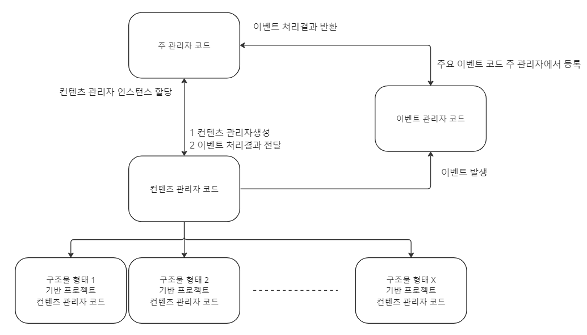
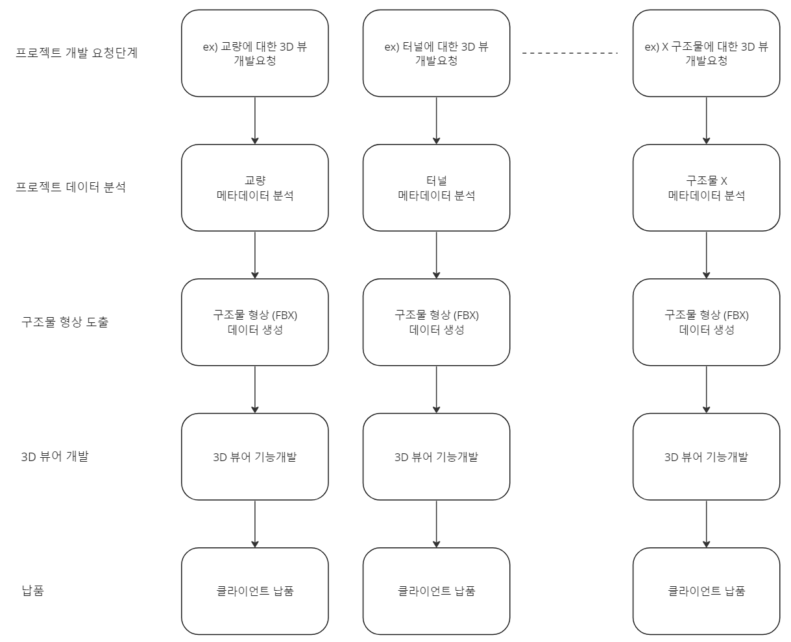
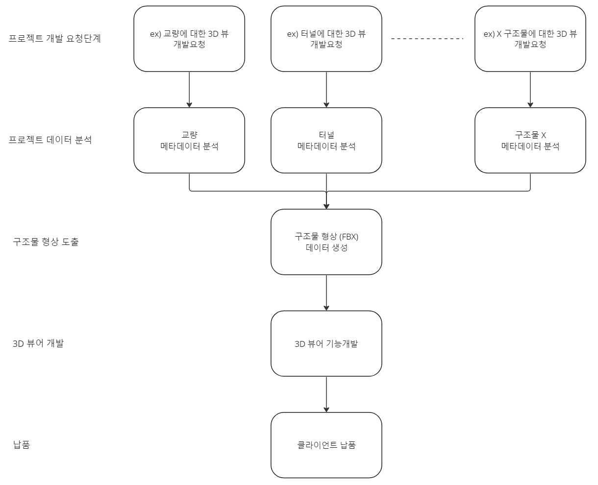

# Viewer_Baseline_2
 
### 개발 컨셉

> 2020년 교량 뷰어 , 2021년 터널 뷰어의 뷰어 기능의 내용을 모아서 범용 뷰어의 기반코드를 새롭게 제작한다.

 

기존 프로젝트의 문제점

- 기존의 개발 프로세스는 [신규 프로젝트 수주] → [프로젝트 기획] → [구현] → [납품]의 순으로 진행됨.
- 프로젝트의 개발 요청, 구조물 메타데이터를 제외하고 나머지 업무는 유사성이 높은 업무를 진행함.
- 비즈니스의 영역에서, 프로젝트의 구성요소를 분석함.

 

 프로젝트 업무 분석 결과

- 프로젝트 업무 분석 결과, 위의 도식이 도출됨.
- ⭐ 구조물 형상 데이터는 결국 어떤 프로젝트건 fbx 또는 obj 형태로 도출됨.
- fbx 또는 obj 데이터를 압축하는 데이터를 만들어 내더라도, 3D 메시로 표현될 수 있는 모델 데이터를 만들어내기만 한다면, 뷰어에 표시할 데이터는 3D 모델임.
- 코드의 재사용성을 확보할 수 있고, 타 회사와의 경쟁에서 경쟁 우위를 차지할 수 있는 방법으로 범용 뷰어를 만드는 안을 도출해냄.

 

### 프로젝트 개발 목표

- 위 업무 분석에 따라 3D 모델 데이터를 볼 수 있는 뷰어를 개발한다.
- (모델 메타데이터에 대한 건) 메타데이터 분석으로 생성되는 3D 모델 데이터의 부재별 라벨 코드는 기획 단계에서 작성된 해석 문서를 참고한다.
- (뷰어에 관련된 것) 프로젝트별로 개발되던 뷰어를 단일 범용 뷰어로 통합한다.
- 핵심으로 개발될 코드가 작성, 관리될 영역과 수주한 프로젝트별로 커스터마이징할 코드가 작성될 영역을, 구조적, 코드적으로 분할한다.
- ⭐ 위의 활동으로 프로젝트 메타데이터 분석 및 구현에 대한 영역을 제외한 뷰어에 관련된 재사용성을 극도로 확보하여 평균 6,7개월 걸리는 개발 기간을 평균 2,3개월로 최대 66% 단축한다.